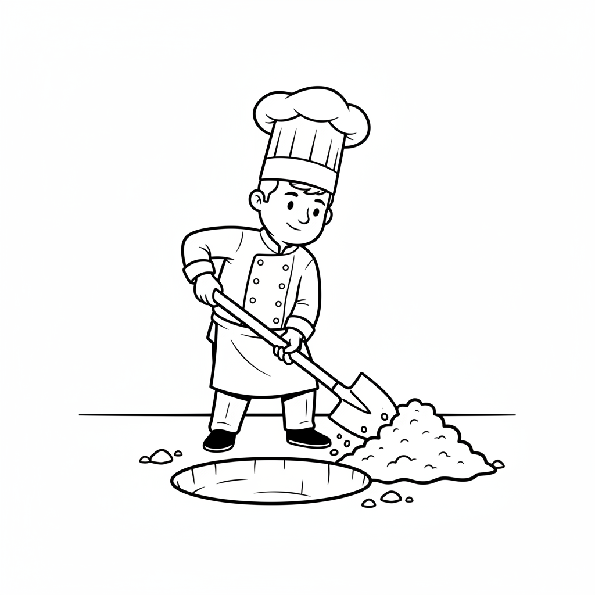
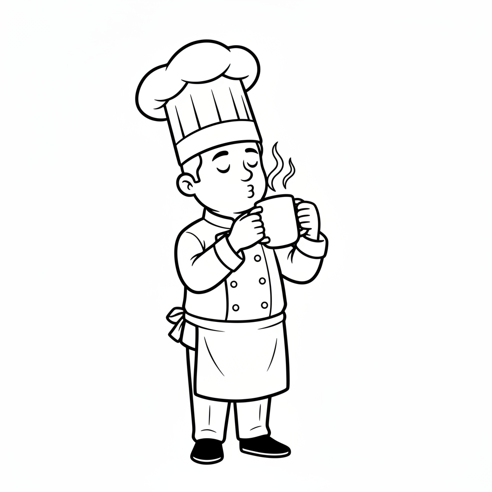
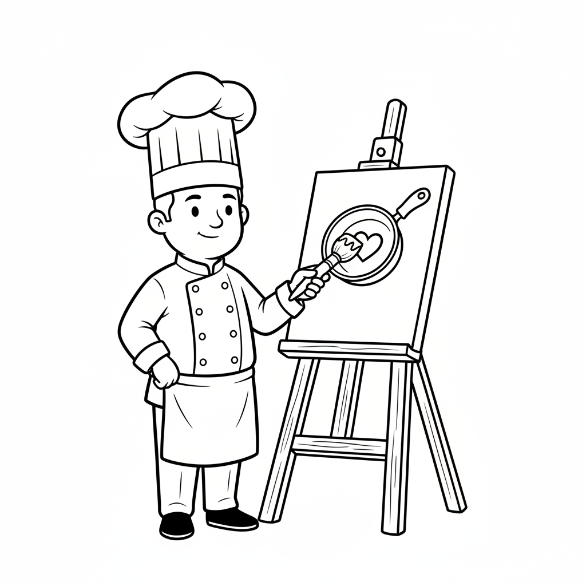
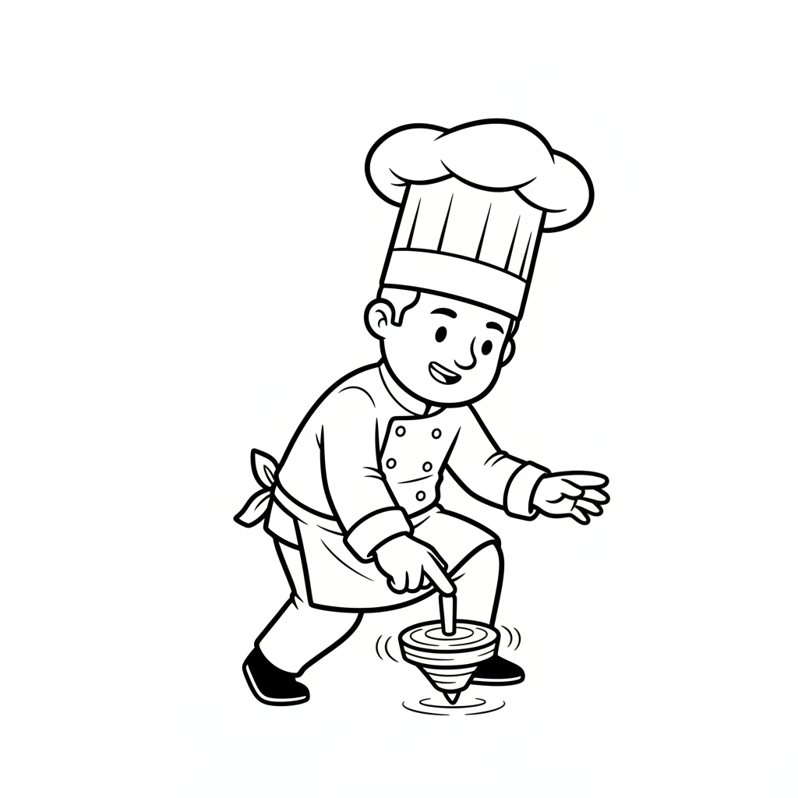
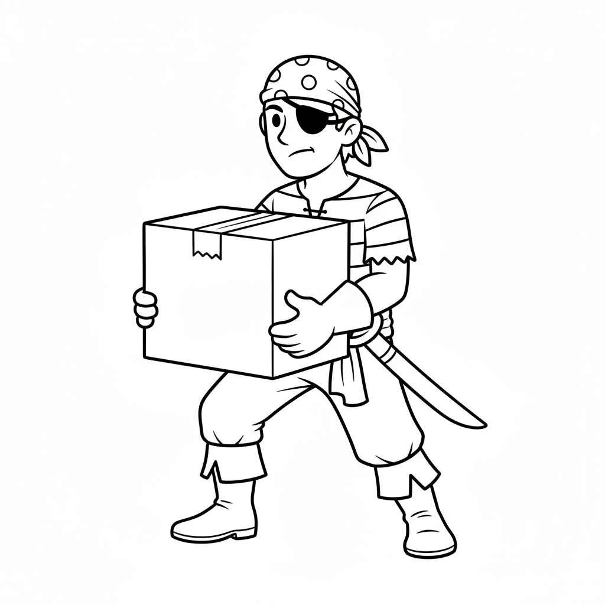
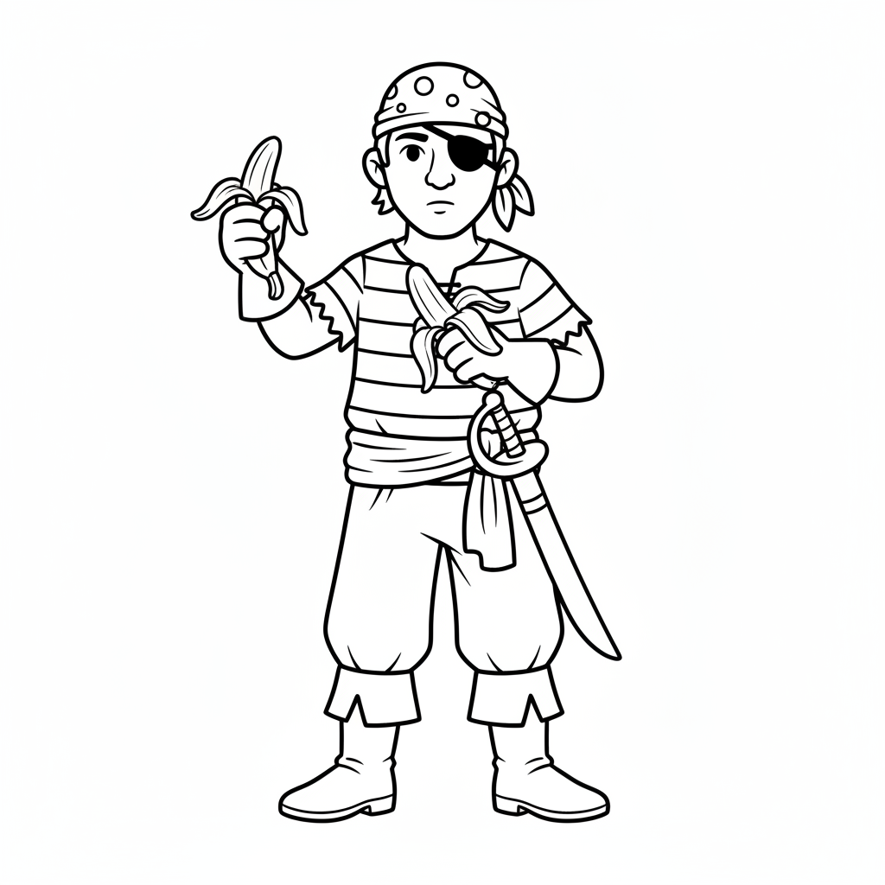
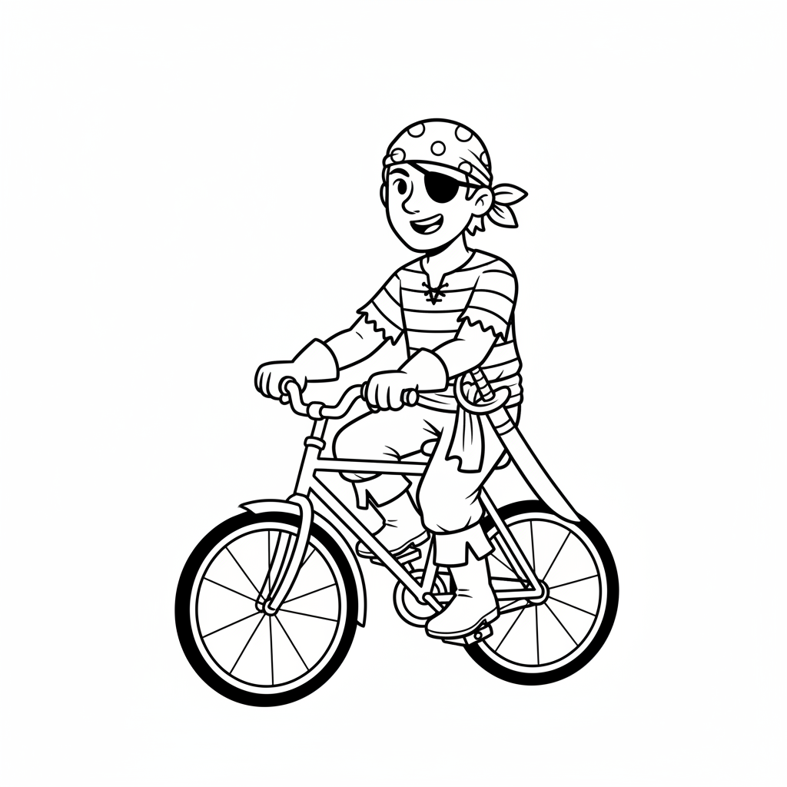
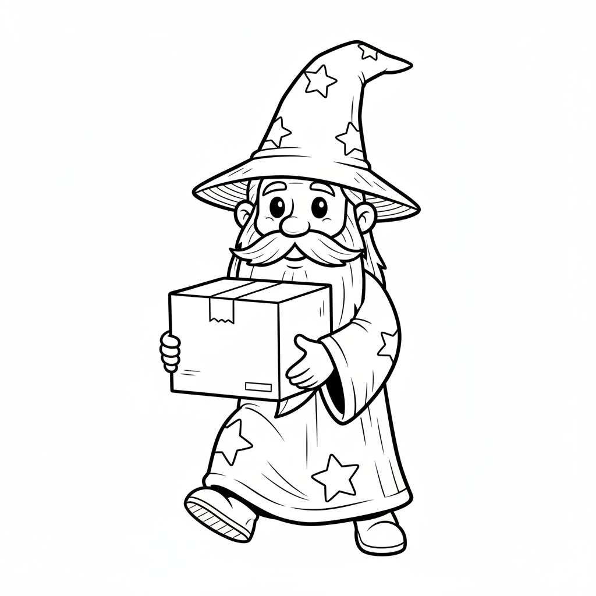
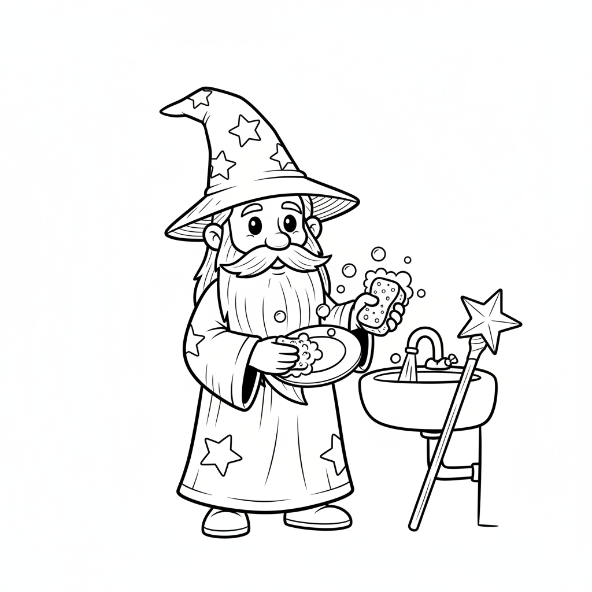

# Tense Planning Project

This project investigates the dissociation between syntactic planning (tense feature/diacritic selection) and phonological planning (morph realization) in language production.

## Project Structure

The repository is organized as follows:

- **`experiments/`**: Contains the source code and materials for psycholinguistic experiments.
  - `conceptual-task/`: A PCIbex experiment testing tense planning using a switch task paradigm.
  - `norming/`: A norming experiment to validate aspectual properties of stimuli. [DEMO for the norming experiment](https://farm.pcibex.net/p/qHbGqX/)
  - `morphophonology/`: (Planned) Experiment focusing on phonological planning.
  - `morphosyntax/`: (Planned) Experiment focusing on syntactic planning.
- **`analysis/`**: Scripts and notebooks for data analysis and stimulus generation.
  - `regular_irregular_freqmatch.ipynb`: Notebook for matching verb frequencies. 
  - `experiment_materials_generator.ipynb`: Notebook for generating experiment materials. 
- **`presentations/`**: Slides and posters for conferences and talks.
  - `bling/`: Presentation materials for BLING.
- **`paper/`**: Manuscripts, drafts, and figures for publication.
- **`notes/`**: Research notes, meeting minutes, and literature reviews.
- **`doc/`**: Additional project-level documentation.

## Getting Started

### Conceptual Task
To run or edit the main experiment, navigate to `experiments/conceptual-task/`.
See the [Experiment README](experiments/conceptual-task/README.md) for details on the design, conditions, and deployment.

## Research Goals

1. **Overall Goal**: Test dissociation between syntactic and phonological planning.
2. **Current Focus**: Establish that the entropy-manipulation (switch task) works as intended using the `conceptual-task`.

## Selected Conceptual-Task Images

Best versions selected from `experiments/conceptual-task/chunk_includes` (generated from `combined_selection_report.csv`).

| Character | Verb | Object | Best Image |
| :--- | :--- | :--- | :---: |
| Chef | blow | bubbles |  |
| Chef | build | tower |  |
| Chef | carry | box |  |
| Chef | climb | ladder |  |
| Chef | dig | hole |  |
| Chef | drag | sack |  |
| Chef | drink | coffee |  |
| Chef | eat | apple |  |
| Chef | paint | canvas |  |
| Chef | peel | banana |  |
| Chef | play | guitar |  |
| Chef | push | cart |  |
| Chef | read | book |  |
| Chef | ride | bicycle |  |
| Chef | shake | bottle |  |
| Chef | smell | flower |  |
| Chef | spin | top |  |
| Chef | stir | pot |  |
| Chef | sweep | floor |  |
| Chef | wash | dish |  |
| Pirate | blow | bubbles |  |
| Pirate | build | tower |  |
| Pirate | carry | box |  |
| Pirate | climb | ladder |  |
| Pirate | dig | hole |  |
| Pirate | drag | sack |  |
| Pirate | drink | coffee |  |
| Pirate | eat | apple |  |
| Pirate | paint | canvas |  |
| Pirate | peel | banana |  |
| Pirate | play | guitar |  |
| Pirate | push | cart |  |
| Pirate | read | book |  |
| Pirate | ride | bicycle |  |
| Pirate | shake | bottle |  |
| Pirate | smell | flower |  |
| Pirate | spin | top |  |
| Pirate | stir | pot |  |
| Pirate | sweep | floor |  |
| Pirate | wash | dish |  |
| Wizard | blow | bubbles |  |
| Wizard | build | tower |  |
| Wizard | carry | box |  |
| Wizard | climb | ladder |  |
| Wizard | dig | hole |  |
| Wizard | drag | sack |  |
| Wizard | drink | coffee |  |
| Wizard | eat | apple |  |
| Wizard | paint | canvas |  |
| Wizard | peel | banana |  |
| Wizard | play | guitar |  |
| Wizard | push | cart |  |
| Wizard | read | book |  |
| Wizard | ride | bicycle |  |
| Wizard | shake | bottle |  |
| Wizard | smell | flower |  |
| Wizard | spin | top |  |
| Wizard | stir | pot |  |
| Wizard | sweep | floor |  |
| Wizard | wash | dish |  |

