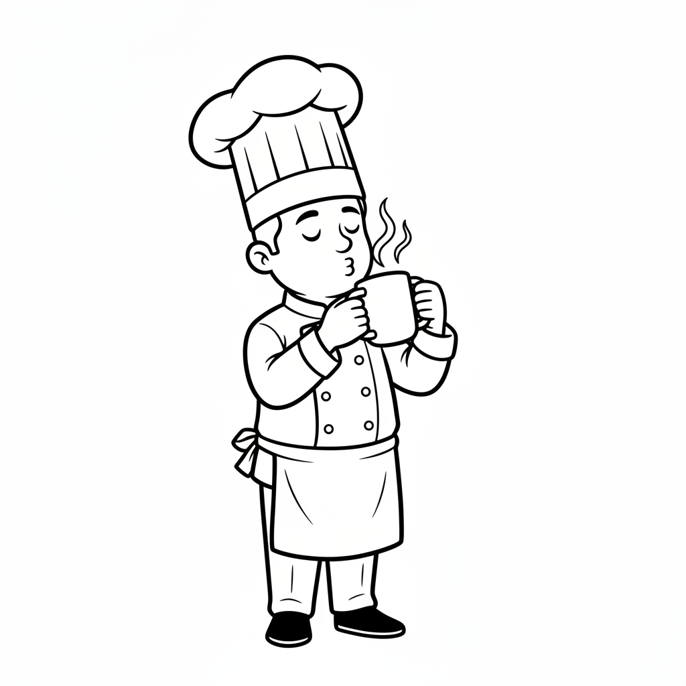
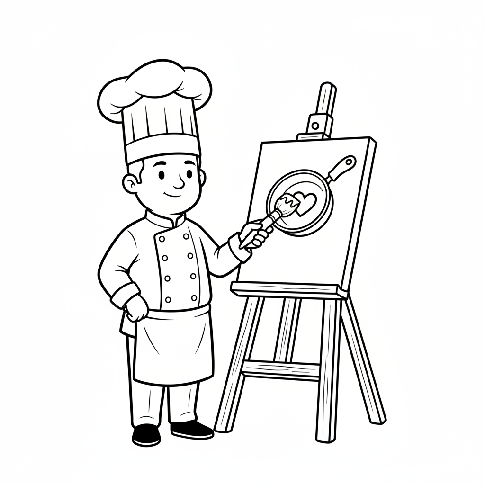
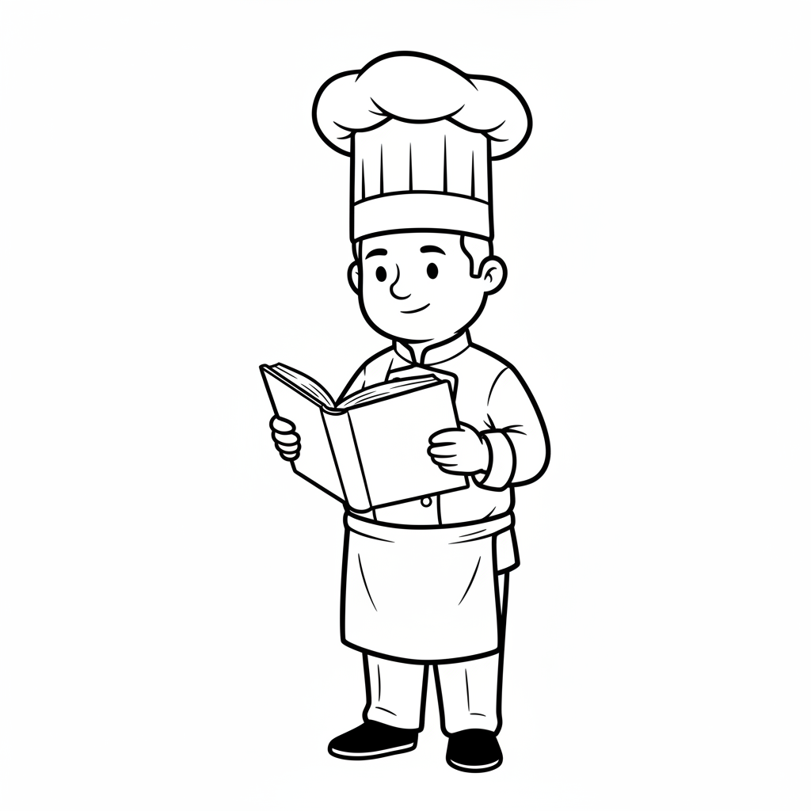
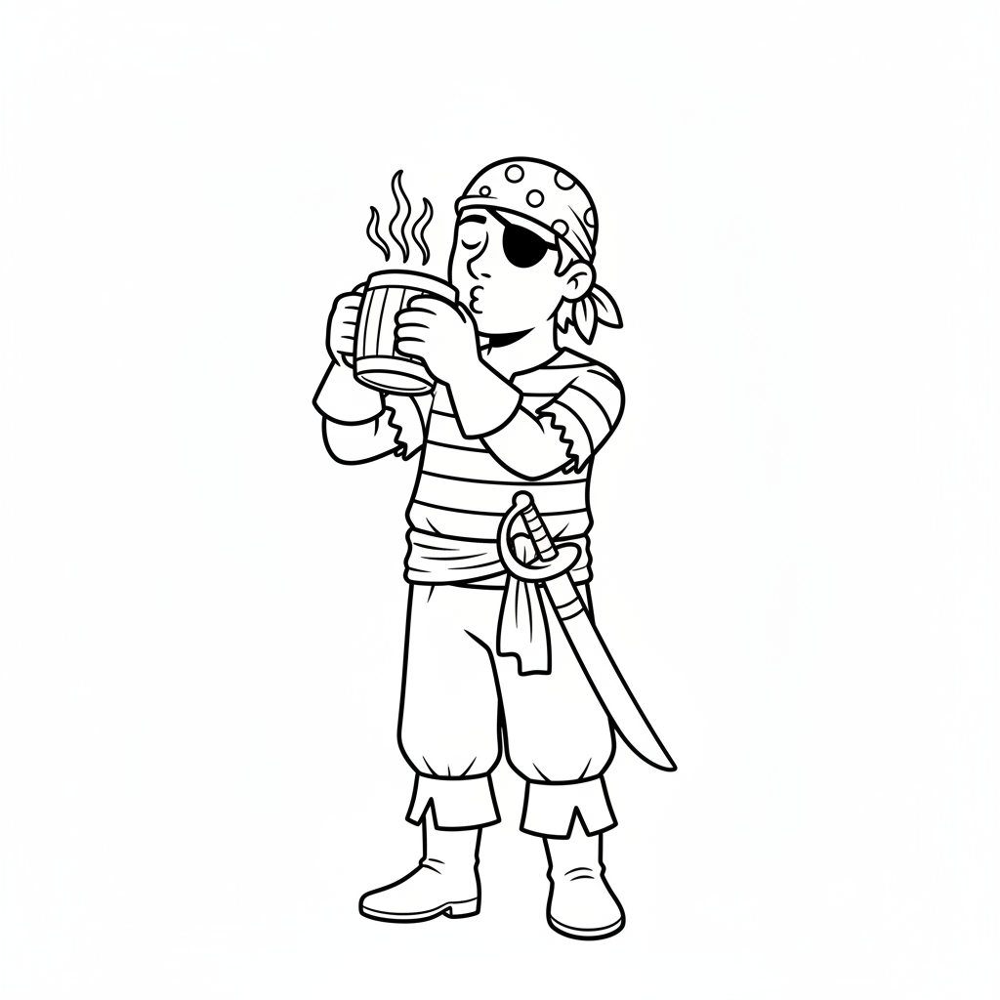
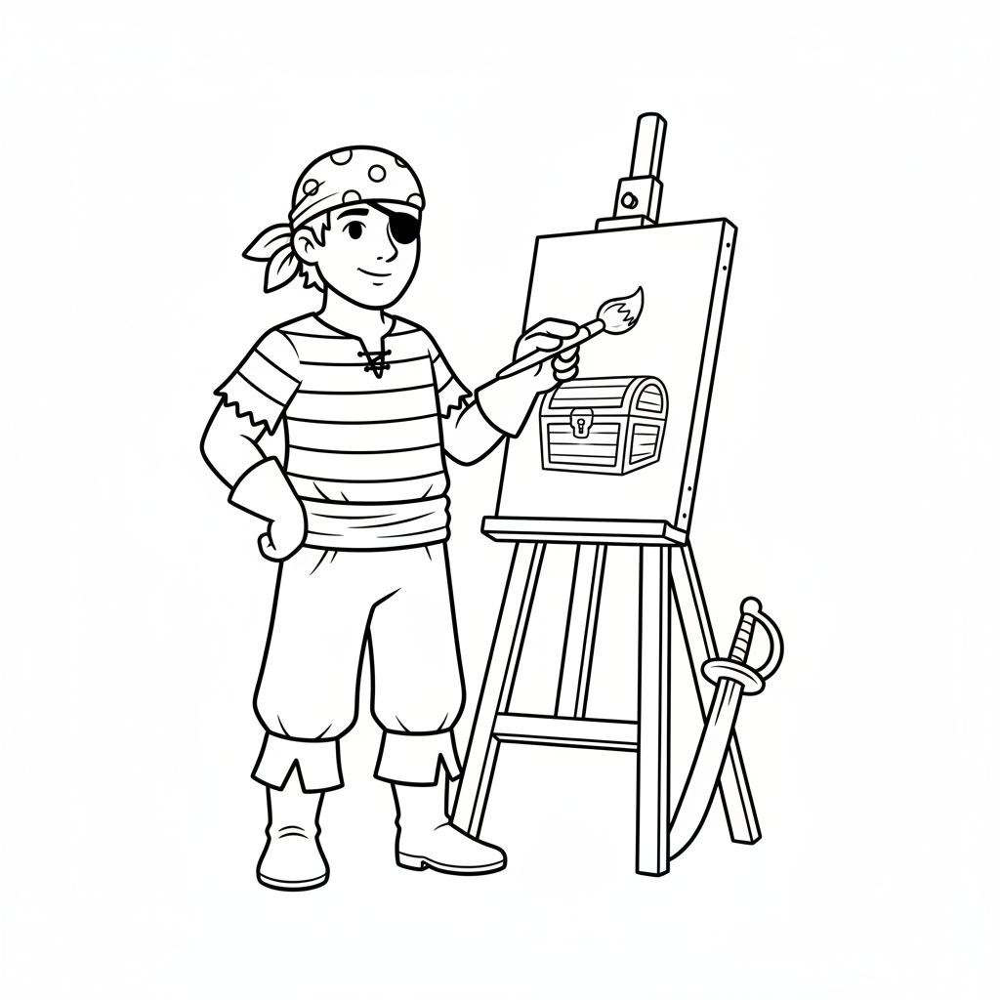
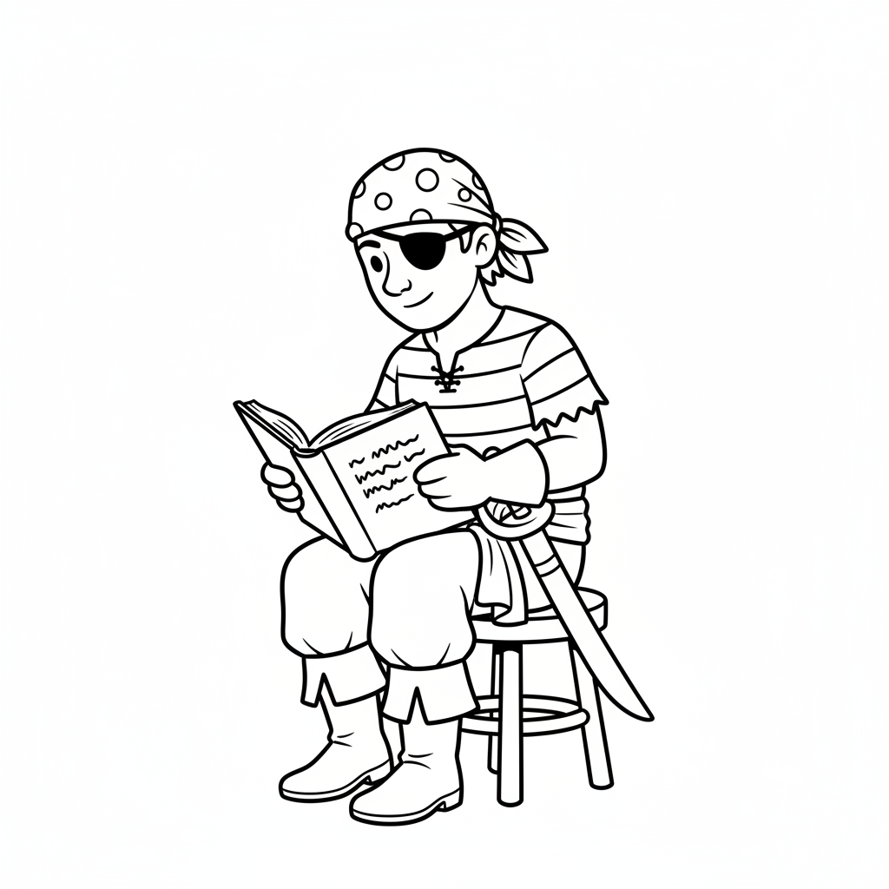
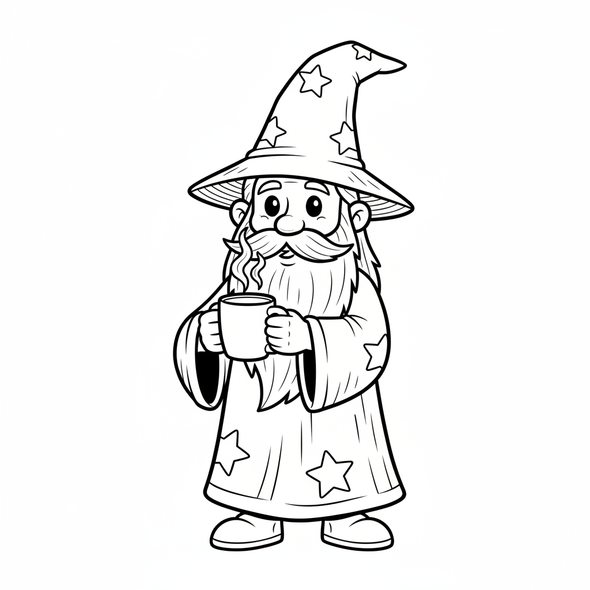
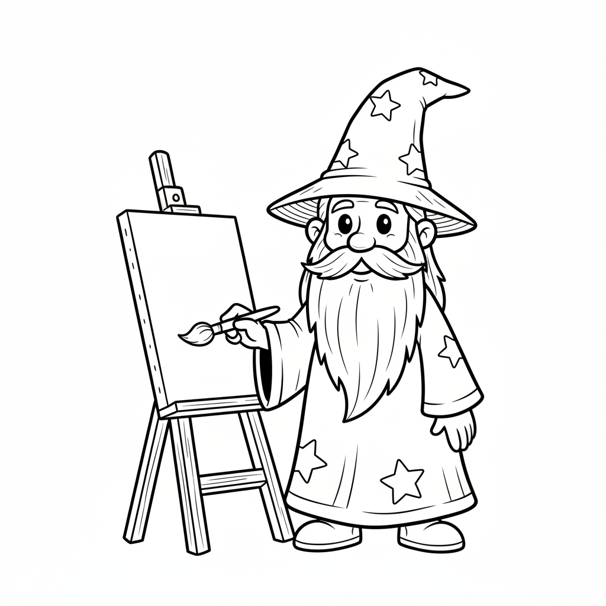
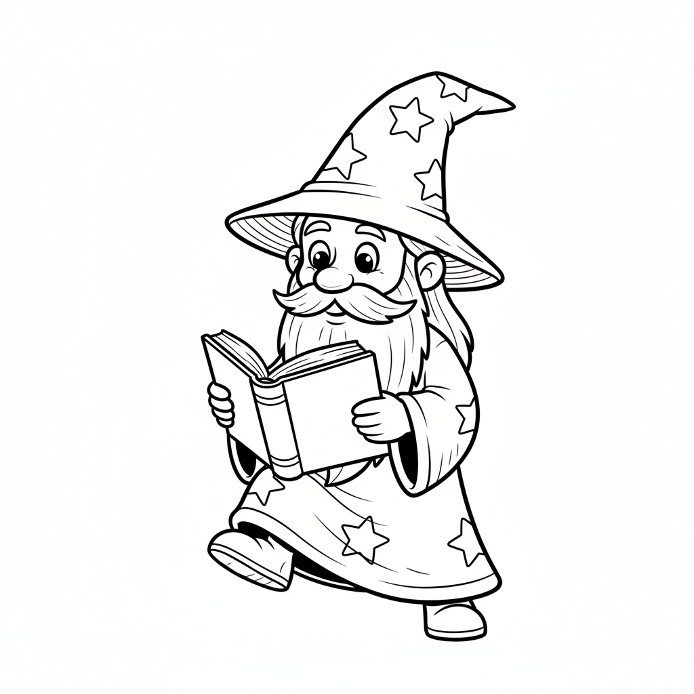

# Tense Planning Project

This project investigates the dissociation between syntactic planning (tense feature/diacritic selection) and phonological planning (morph realization) in language production.

## Project Structure

- **`experiments/`**: Source code and materials for psycholinguistic experiments.
  - [`norming/`](experiments/norming/): Norming experiment for stimulus validation. Branch: [`norming`](https://github.com/utkuturk/tense-timing/tree/norming). [Live demo](https://farm.pcibex.net/p/qHbGqX/)
  - [`conceptual-task/`](experiments/conceptual-task/): A non-linguistic decision task. Participants are being thought which event happens when and asked to remember. The trials are ordered in a way that the previous trial is either a prime or not a prime. (PCIbex). Branch: [`conceptual-task`](https://github.com/utkuturk/tense-timing/tree/conceptual-task). [Live demo](https://farm.pcibex.net/r/ZlMqba/)
  - [`morphosyntax/`](experiments/morphosyntax/): A production version of the conceptual task. Intead of the non-linguistic task, participants are asked to produce sentences according to the time and the event taught to them. Branch: [`morphosyntax`](https://github.com/utkuturk/tense-timing/tree/morphosyntax)
  - [`morphophonology/`](experiments/morphophonology/): A version of the morphosyntax experiment, where all participants where asked to produce sentences in past tense. But now the priming is done according to past tense form regularity.  Branch: [`morphophonology`](https://github.com/utkuturk/tense-timing/tree/morphophonology)
- **`analysis/`**: Scripts and notebooks for data analysis and stimulus generation.
  - `regular_irregular_freqmatch.ipynb` 
  - `experiment_materials_generator.ipynb` 
- **`presentations/`**: Slides and posters for conferences and talks.
- **`paper/`**: Manuscripts, drafts, and figures for publication.
- **`notes/`**: Research notes, meeting minutes, and literature reviews.

## Research Goals

1. **Overall Goal**: Test dissociation between syntactic and phonological planning.

## Conceptual Task

Participants learn action verbs for characters (Chef, Pirate, Wizard), study tense assignments (past/future), then make speeded tense decisions via key press (`C = Past`, `M = Future`). The task includes a practice phase followed by 3 meta-blocks (9 blocks total, 108 decision trials). See the [experiment README](experiments/conceptual-task/README.md) for full details.

###  Experiment Structure

Each meta-block has 3 blocks of 6 verbs, and each block is organized by tense assignment: 3 **Past** and 3 **Future** items (counterbalanced by list). Block order is shuffled within each meta-block; entity-verb pairings rotate across meta-blocks.

Tense-order patterns used within blocks:

- Raw patterns:
  - `F P P F F P`
  - `P F F P P F`
- Annotated with boundary and priming status:
  - `Fb Pu Pp Fu Fp Pe`
  - `Pb Fu Fp Pu Pp Fe`

Legend: `b = beginning`, `e = end`, `p = primed` (same tense as previous trial), `u = unprimed` (switch from previous trial).

<b>Block 1 verbs</b>

| Verb | Tense role | Object |
|:-----|:-----------|:-------|
| drink | Past/Future (counterbalanced) | coffee |
| read | Past/Future (counterbalanced) | a book |
| eat | Past/Future (counterbalanced) | an apple |
| paint | Past/Future (counterbalanced) | a canvas |
| wash | Past/Future (counterbalanced) | a dish |
| push | Past/Future (counterbalanced) | a cart |

<b>Block 2 verbs</b>

| Verb | Tense role | Object |
|:-----|:-----------|:-------|
| build | Past/Future (counterbalanced) | a tower |
| sweep | Past/Future (counterbalanced) | the floor |
| ride | Past/Future (counterbalanced) | a bicycle |
| climb | Past/Future (counterbalanced) | a ladder |
| stir | Past/Future (counterbalanced) | a pot |
| peel | Past/Future (counterbalanced) | a banana |

<b>Block 3 verbs</b>

| Verb | Tense role | Object |
|:-----|:-----------|:-------|
| blow | Past/Future (counterbalanced) | bubbles |
| dig | Past/Future (counterbalanced) | a hole |
| shake | Past/Future (counterbalanced) | a bottle |
| carry | Past/Future (counterbalanced) | a box |
| play | Past/Future (counterbalanced) | the guitar |
| smell | Past/Future (counterbalanced) | a flower |

<b>Sample stimuli images (one per character)</b>

| Character | Example |
|:----------|:--------|
| Chef |    |
| Pirate |    |
| Wizard |    |

## Morphosyntax

The morphosyntax experiment is a spoken-production adaptation of the conceptual task.
Participants still learn event-time mappings (Past vs Future), but instead of keypress decisions they produce canonical sentences aloud (e.g., `The Pirate will spin a top.` / `The Pirate spun a top.`).
The tense sequencing logic remains tied to the conceptual-task-style P/F ordering and prime structure.

###  Experiment Structure

- Core unit: 3 meta-blocks x 3 blocks
- Per block: verb learning, tense mapping, then spoken production trials
- Ordering: Past/Future patterning with primed vs unprimed transitions inherited from the conceptual design

## Morphophonology

Morphophonology is a past-only spoken-production variant.
Participants always produce past tense, and trial ordering is manipulated by **regular vs irregular** past-tense morphology rather than Past/Future conceptual assignment.

###  Experiment Structure

- Core unit: 3 meta-blocks x 3 blocks
- Per block: verb learning and spoken production
- Ordering patterns: `I R R I I R` and `R I I R R I`
- Priming is defined by morphological regularity repetition/switch
