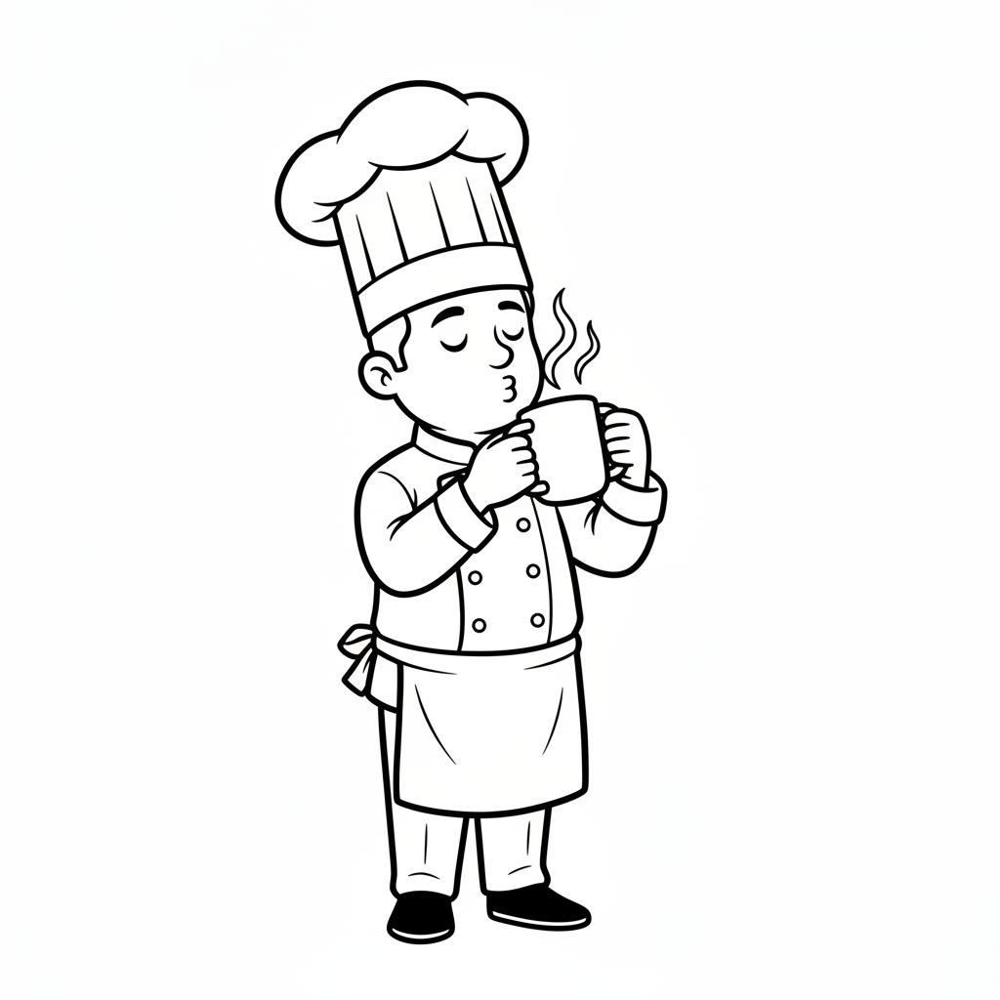
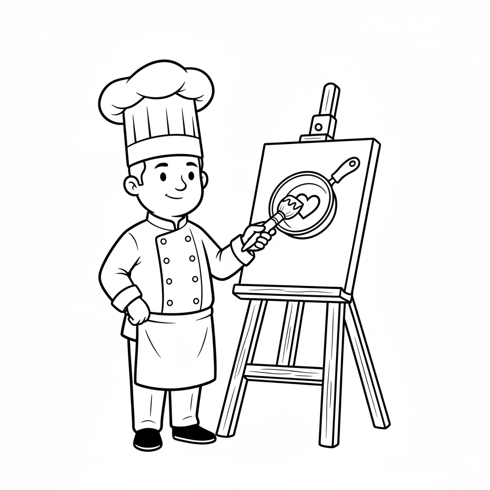
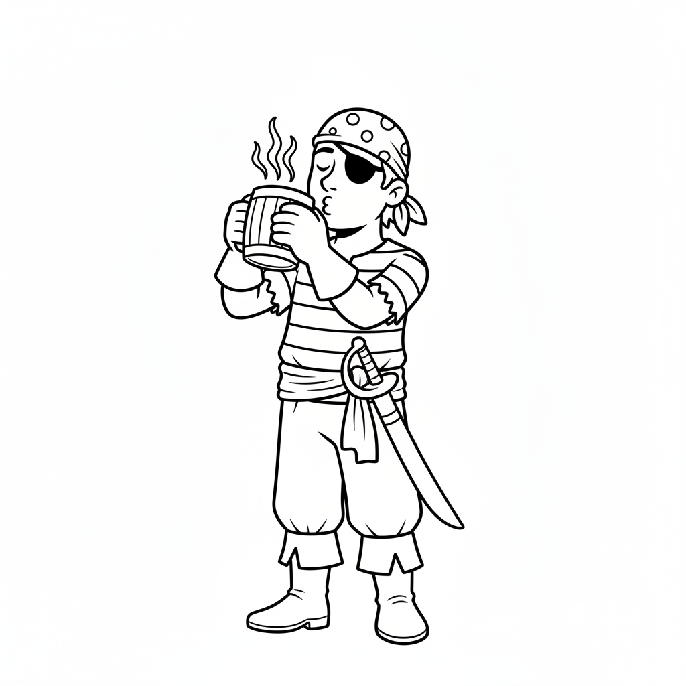
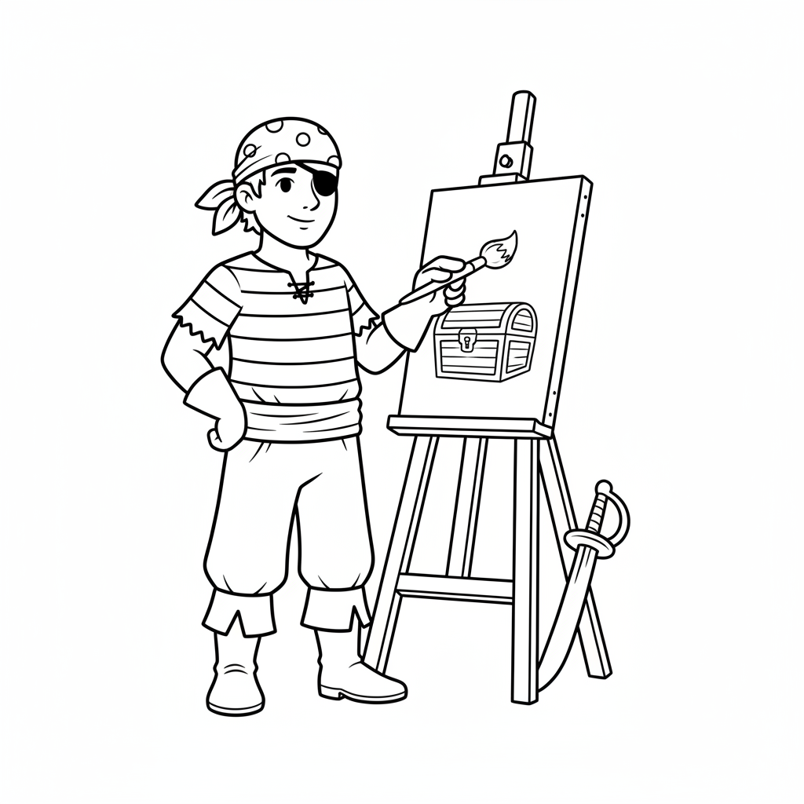
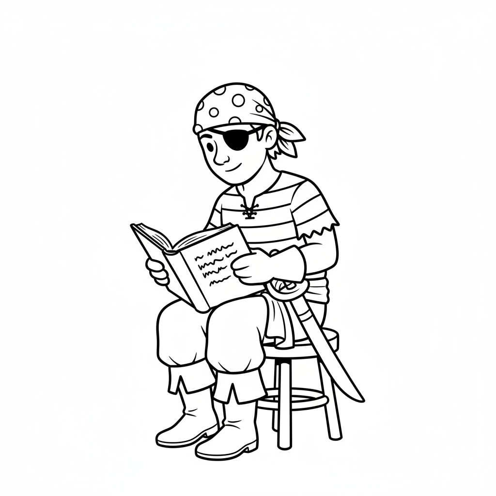
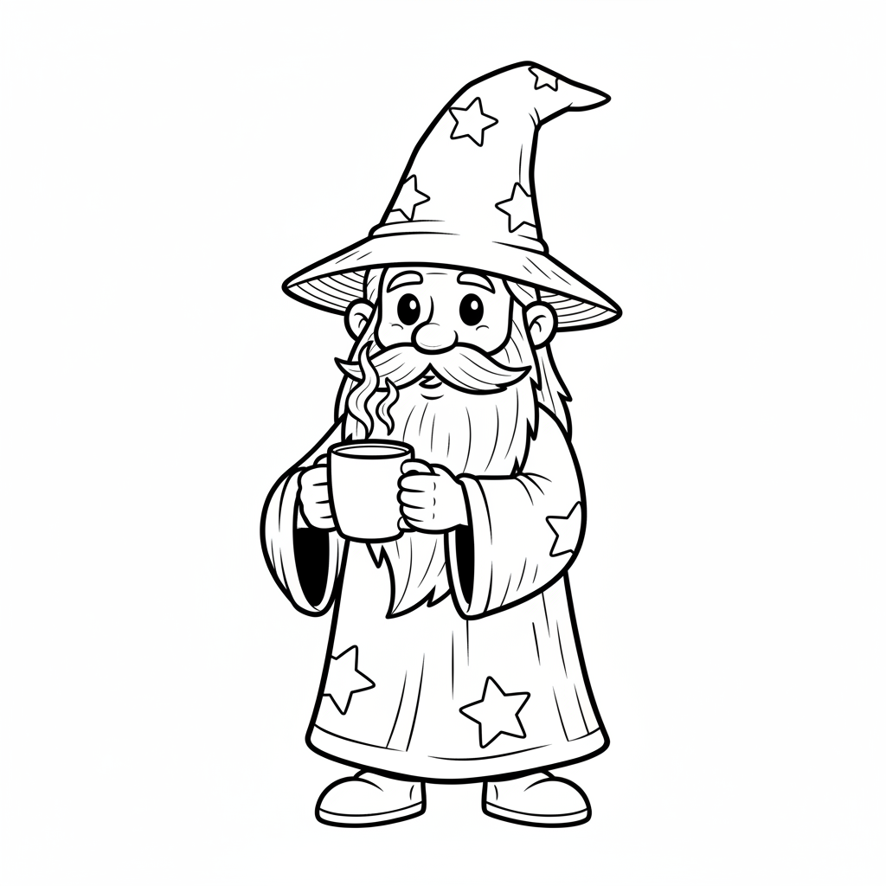
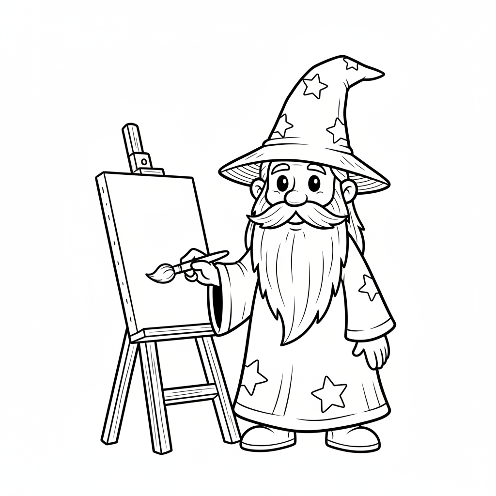
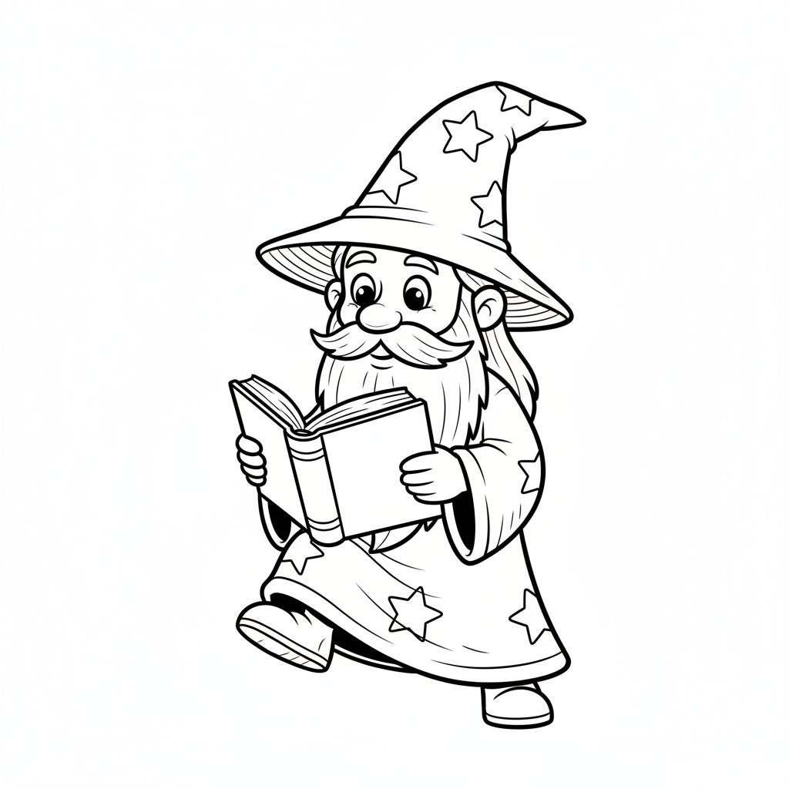

# Tense Planning Project

This project investigates the dissociation between syntactic planning (tense feature/diacritic selection) and phonological planning (morph realization) in language production.


## Project Structure

- **`experiments/`**: Source code and materials for psycholinguistic experiments.
  - [`norming/`](experiments/norming/): Norming experiment for stimulus validation. Branch: [`norming`](https://github.com/utkuturk/tense-timing/tree/norming). [Live demo](https://farm.pcibex.net/p/qHbGqX/)
  - [`conceptual-task/`](experiments/conceptual-task/): A non-linguistic decision task. Participants are being thought which event happens when and asked to remember. The trials are ordered in a way that the previous trial is either a prime or not a prime. (PCIbex). Branch: [`conceptual-task`](https://github.com/utkuturk/tense-timing/tree/conceptual-task). [Live demo](https://farm.pcibex.net/r/ZlMqba/)
  - [`morphosyntax/`](experiments/morphosyntax/): A production version of the conceptual task. Intead of the non-linguistic task, participants are asked to produce sentences according to the time and the event taught to them. Branch: [`morphosyntax`](https://github.com/utkuturk/tense-timing/tree/morphosyntax)
  - [`morphophonology/`](experiments/morphophonology/): A version of the morphosyntax experiment, where all participants where asked to produce sentences in past tense. But now the priming is done according to past tense form regularity.  Branch: [`morphophonology`](https://github.com/utkuturk/tense-timing/tree/morphophonology)
- **`analysis/`**: Analysis source, figures and the rendered report. Model fits and the
  MFA working tree are generated locally and left untracked.
  - [`analysis.qmd`](analysis/analysis.qmd): main Quarto analysis; renders to `analysis.pdf`.
  - `fig_output/`: figures produced by `analysis.qmd`.
  - `scripts/`: recording preparation, transcription and forced alignment
    (`prepare_recordings.sh` → `transcribe_to_lab.py` → `run_mfa.sh`).
  - `mfa/`: forced-alignment working tree (`corpus/`, `aligned/`, `runs/`, `state/`), untracked.
  - `notebooks/`:
    - `regular_irregular_freqmatch.ipynb` <a target="_blank" href="https://colab.research.google.com/github/utkuturk/tense-timing/blob/main/analysis/notebooks/regular_irregular_freqmatch.ipynb"></a>
    - `experiment_materials_generator.ipynb` <a target="_blank" href="https://colab.research.google.com/github/utkuturk/tense-timing/blob/main/analysis/notebooks/experiment_materials_generator.ipynb"></a>
- **`stimuli/`**: Image generation and selection pipeline for the experiment materials,
  with the resulting scores and the selected image set. Run the scripts from the repository
  root. See [`stimuli/README.md`](stimuli/README.md).
- **`data/`**: Derived participant tables (`*_june6.csv`) and verb frequency norms. Raw
  per-participant archives and audio recordings live in `data/phon/` and `data/syn/` and
  are untracked.
- **`docs/`**: Research notes and meeting minutes ([`notes/`](docs/notes/), including
  [`exp_details.md`](docs/notes/exp_details.md)), and slides and posters
  ([`presentations/`](docs/presentations/)).

## Experiments and their branches

Each experiment lives in two places: as `experiments/<name>/` here on `main`, and
as the root of a standalone branch `<name>`. The branches exist because PCIbex
fetches assets at runtime from
`raw.githubusercontent.com/utkuturk/tense-timing/<branch>/chunk_includes/...`.

**`main` is the source of truth.** Edit `experiments/<name>/` on `main`; the
branch is derived from it. Pushing a change under `experiments/` to `main` fires
`.github/workflows/sync-experiment-branches.yml`, which adds a commit to each
affected branch making its tree match `main` and pushes it. Nothing is rewritten
or force-pushed, and unaffected branches are left alone.

To do the same by hand, or to check what would change:

```
experiments/sync-to-branches.sh            # update local branches only
experiments/sync-to-branches.sh --push     # and push them
```

It is idempotent, so running it when everything already matches does nothing.

A consequence worth knowing: a commit made directly on an experiment branch stays
in that branch's history, but its *content* is superseded the next time `main`
syncs. Make the edit on `main` instead.

The SONA credit links in each `data_includes/main.js` ship as
`experiment_id=XX&credit_token=XX`. Fill in the real values from the SONA
researcher dashboard when deploying to PCIbex; they are not kept in this
repository.

## Running the pipeline

All scripts take repository-root-relative paths and expect to be run from the
repository root:

```
uv run analysis/scripts/prepare_recordings.sh      # zips -> analysis/mfa/corpus/
uv run python analysis/scripts/transcribe_to_lab.py  # .wav -> .lab transcripts
bash analysis/scripts/run_mfa.sh                   # -> analysis/mfa/aligned/
quarto render analysis/analysis.qmd                # -> analysis.pdf, fig_output/
```

## Research question

Tense has to be planned before a sentence is spoken, but planning it involves two
things that can come apart: choosing the tense feature, which is a decision about
the structure of the sentence, and retrieving the form that realises it, which is
a decision about the word. If those are separate operations, they should leave
their traces at different points in the utterance. Selecting a feature happens
before articulation starts, so it should show up early, at the onset of the
sentence. Retrieving a form is not needed until the word carrying it is spoken,
so it should show up late, around the verb.

Each experiment repeats something from the previous trial and asks where in the
next utterance the repetition helps. Experiment 3 repeats the tense; Experiment 2
repeats the morphophonological form; Experiment 1 repeats the decision without
requiring any speech, as a control on whether repetition effects need to be
linguistic at all.

| Report label | Directory | Task | Repeated across trials |
|:--|:--|:--|:--|
| Experiment 1 | `conceptual-task/` | Speeded keypress (`C` past, `M` future) | Tense of the decision |
| Experiment 2 | `morphophonology/` | Spoken production, all past tense | Regular vs irregular past form |
| Experiment 3 | `morphosyntax/` | Spoken production, past vs future | Tense |
| (stimulus norming) | `norming/` | 1-7 sentence-picture fit rating | n/a |

## Findings

Estimates are Bayesian posterior means on the log scale with 95% credible
intervals; P(dir) is the posterior probability that the effect has the stated
sign. Full models, priors and checks are in
[`analysis/analysis.pdf`](analysis/analysis.pdf), which these numbers come from.

**The dissociation holds, with the two effects landing where they were predicted
to land.** Form repetition acts late and leaves the start of the sentence
untouched. Tense repetition acts early, at the onset of the subject noun, and
does not reach the verb. Neither effect appears in the non-linguistic control.

**Experiment 1, conceptual task** (106 participants, 7427 analysed trials).
Deciding about the future took longer than deciding about the past, 1125 ms
(SE 11.4) against 1099 ms (SE 11.4), b = 0.028, CrI [0.001, 0.055], P(dir) =
0.98. Repeating the tense of the decision did nothing: 1108 ms (SE 11.2) primed
against 1116 ms (SE 11.6) unprimed, b = 0.007, CrI [-0.044, 0.057], P(dir) =
0.61, and the interaction with tense was centred on zero, b = 0.009, CrI
[-0.035, 0.052], P(dir) = 0.65. Repetition effects in the production experiments
therefore cannot be attributed to repeating a decision.

**Experiment 2, morphophonology** (41 participants after exclusions, 3799 of 4344
trials retained). Repeating an irregular past form shortened the verb, 87
ms/phone (SE 1.5) after an irregular prime against 100 ms/phone (SE 1.7) when
unprimed, while regular verbs moved from 94 to 90 ms/phone; b = 0.030, CrI
[-0.019, 0.068], P(dir) = 0.92. The clearest effect is on pausing before the
verb: pauses occurred on 28.2% (SE 1.8) of trials before an unprimed irregular
and 18.6% (SE 1.5) when the previous trial had also used an irregular, against
16.1% and 17.6% for regulars. All three terms separate, with P(dir) > 0.99 for
each: irregulars draw more pauses (b = -0.492, CrI [-0.719, -0.271]), repetition
reduces pausing (b = 0.413, CrI [0.181, 0.639]), and the reduction is larger for
irregulars (b = 0.690, CrI [0.242, 1.137]). Speech onset was unchanged, 1082 ms
(SE 10.3) primed against 1083 ms (SE 10.6) unprimed. A form effect that leaves
onset alone and surfaces at the verb is what a late, form-based locus predicts.

**Experiment 3, morphosyntax** (17 participants after exclusions, 1400 of 1800
trials retained). Tense affected the utterance throughout: future sentences
reached the subject noun at 1456 ms (SE 20.8) against 1401 ms (SE 20.1) for past,
b = 0.046, CrI [0.004, 0.088], P(dir) = 0.98. Tense repetition on its own did
nothing (b = 0.009, CrI [-0.034, 0.052], P(dir) = 0.67), but it interacted with
tense at the onset of the subject noun, b = 0.036, CrI [-0.035, 0.106], P(dir) =
0.85, and at no later measure. With 17 participants this is suggestive rather
than established; the report estimates that resolving it needs roughly 45.

**Stimulus norming** (12 participants retained of 17, 641 trials; numbers from
[`experiments/norming/scripts/norming.html`](experiments/norming/scripts/norming.html)).
The pictures afford past and future descriptions equally well. The
future-minus-past reading time difference was 13.7 ms, 95% CrI [-166.2, 191.3],
with P(future > past) = 0.56, and the expected rating difference was -0.273, 95%
CrI [-0.794, 0.042].

### Open

Experiment 3 is underpowered for its key interaction and is the obvious thing to
run again. `data/todo.md` tracks the remaining data-side work.

## Conceptual Task

Participants learn action verbs for characters (Chef, Pirate, Wizard), study tense assignments (past/future), then make speeded tense decisions via key press (`C = Past`, `M = Future`). The task includes a practice phase followed by 3 meta-blocks (9 blocks total, 108 decision trials). See the [experiment README](experiments/conceptual-task/README.md) for full details.

###  Experiment Structure

Each meta-block has 3 blocks of 6 verbs, and each block is organized by tense assignment: 3 **Past** and 3 **Future** items (counterbalanced by list). Block order is shuffled within each meta-block; entity-verb pairings rotate across meta-blocks.

Tense-order patterns used within blocks:

- Raw patterns:
  - `F P P F F P`
  - `P F F P P F`
- Annotated with boundary and priming status:
  - `F<sub>b</sub> P<sub>u</sub> P<sub>p</sub> F<sub>u</sub> F<sub>p</sub> P<sub>e</sub>`
  - `P<sub>b</sub> F<sub>u</sub> F<sub>p</sub> P<sub>u</sub> P<sub>p</sub> F<sub>e</sub>`

Legend: `b = beginning`, `e = end`, `p = primed` (same tense as previous trial), `u = unprimed` (switch from previous trial).

<details>
<summary><b>Block 1 verbs</b></summary>

| Verb | Tense role | Object |
|:-----|:-----------|:-------|
| drink | Past/Future (counterbalanced) | coffee |
| read | Past/Future (counterbalanced) | a book |
| eat | Past/Future (counterbalanced) | an apple |
| paint | Past/Future (counterbalanced) | a canvas |
| wash | Past/Future (counterbalanced) | a dish |
| push | Past/Future (counterbalanced) | a cart |

</details>

<details>
<summary><b>Block 2 verbs</b></summary>

| Verb | Tense role | Object |
|:-----|:-----------|:-------|
| build | Past/Future (counterbalanced) | a tower |
| sweep | Past/Future (counterbalanced) | the floor |
| ride | Past/Future (counterbalanced) | a bicycle |
| climb | Past/Future (counterbalanced) | a ladder |
| stir | Past/Future (counterbalanced) | a pot |
| peel | Past/Future (counterbalanced) | a banana |

</details>

<details>
<summary><b>Block 3 verbs</b></summary>

| Verb | Tense role | Object |
|:-----|:-----------|:-------|
| blow | Past/Future (counterbalanced) | bubbles |
| dig | Past/Future (counterbalanced) | a hole |
| shake | Past/Future (counterbalanced) | a bottle |
| carry | Past/Future (counterbalanced) | a box |
| play | Past/Future (counterbalanced) | the guitar |
| smell | Past/Future (counterbalanced) | a flower |

</details>

<details>
<summary><b>Sample stimuli images (one per character)</b></summary>

| Character | Example |
|:----------|:--------|
| Chef |    |
| Pirate |    |
| Wizard |    |

</details>


## Morphosyntax

The morphosyntax experiment is a spoken-production adaptation of the conceptual task.
Participants still learn event-time mappings (Past vs Future), but instead of keypress decisions they produce canonical sentences aloud (e.g., `The Pirate will spin a top.` / `The Pirate spun a top.`).
The tense sequencing logic remains tied to the conceptual-task-style P/F ordering and prime structure.

###  Experiment Structure

- Core unit: 3 meta-blocks x 3 blocks
- Per block: verb learning, tense mapping, then spoken production trials
- Ordering: Past/Future patterning with primed vs unprimed transitions inherited from the conceptual design

## Morphophonology

Morphophonology is a past-only spoken-production variant.
Participants always produce past tense, and trial ordering is manipulated by **regular vs irregular** past-tense morphology rather than Past/Future conceptual assignment.

###  Experiment Structure

- Core unit: 3 meta-blocks x 3 blocks
- Per block: verb learning and spoken production
- Ordering patterns: `I R R I I R` and `R I I R R I`
- Priming is defined by morphological regularity repetition/switch
